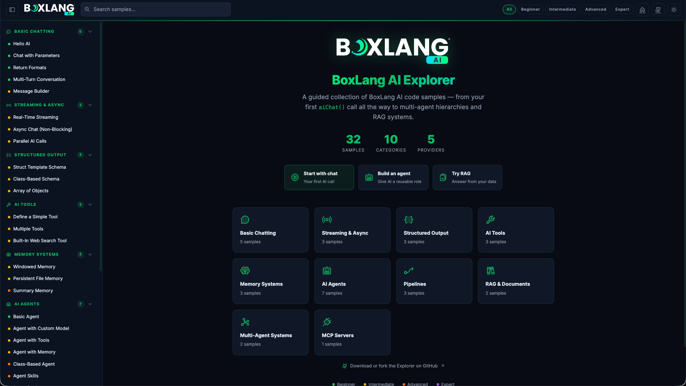

# BoxLang AI Explorer



BoxLang AI Explorer is a local, browser-based catalog of BoxLang AI examples. It presents the `.bxs` files in `samples/` by category and difficulty, with guidance, source code, and sample output for each example.

The samples cover chat, structured responses, streaming, async requests, tools, memory, agents, pipelines, RAG, orchestration, MCP servers, image/speech/audio generation, middleware, reasoning, gateways, human-in-the-loop approvals, security guardrails, agent run control, and AWS Bedrock.

## Requirements

- macOS, Linux, or Windows with a working Java installation supported by BoxLang
- [BoxLang Version Manager (BVM)](https://boxlang.ortusbooks.com/getting-started/installation)
- An API key for the provider you want to use
- The `install-bx-module` command, provided by the BoxLang module development tooling

The repository pins BoxLang `1.16.0` in `.bvmrc`.

## Run Locally

From the repository root:

```sh
# Install the version pinned by this repository, if needed
bvm install 1.16.0
bvm use

# Install this checked-out bx-ai module into the local BoxLang environment
install-bx-module bx-ai --local

# Start BoxLang MiniServer
bvm miniserver
```

Open [http://localhost:8080](http://localhost:8080) in a browser. Stop the server with `Ctrl+C`.

MiniServer reads [`miniserver.json`](miniserver.json), which serves the repository root on `localhost:8080` and uses [`config/boxlang.json`](config/boxlang.json) as the BoxLang configuration file.

To use a different port or enable debug output:

```sh
bvm miniserver --port 9090 --debug
```

Then open [http://localhost:9090](http://localhost:9090).

## Configure Provider Access

Copy the example environment file and replace the placeholder values with real credentials:

```sh
cp .env.example .env
```

Load the variables into the shell before starting MiniServer:

```sh
set -a
. ./.env
set +a
bvm miniserver
```

At minimum, configure the API key for the provider selected in `config/boxlang.json`. The default configuration uses OpenAI:

```json
"provider": "openai"
```

and the default model is `gpt-5.6-luna`. Set `OPENAI_API_KEY` in `.env` or export it directly in your shell:

```sh
export OPENAI_API_KEY="your-api-key"
```

Run `install-bx-module bx-ai --local` again after changing the module source and before testing those changes.

The example environment file lists credentials for OpenAI, Anthropic/Claude, Gemini, DeepSeek, Grok, Groq, Perplexity, OpenRouter, Mistral, Hugging Face, Voyage, Cohere, and AWS providers. Only configure the providers you plan to use. Keep `.env` private and never commit API keys.

## Change the Default Provider or Model

Edit [`config/boxlang.json`](config/boxlang.json):

```json
"settings": {
    "provider": "openai",
    "defaultParams": {
        "model": "gpt-5.6-luna"
    }
}
```

Set `provider` to the provider you want to use and change `defaultParams.model` to a model supported by that provider. Individual samples can override the provider and model in their BoxLang code.

The configuration also controls:

- Request timeout with `timeout`
- Return behavior with `returnFormat` (`single`, `all`, or `raw`)
- Request and response logging with the `logRequest`, `logRequestToConsole`, `logResponse`, and `logResponseToConsole` settings
- Agent skill discovery with `skillsDirectory` and `autoLoadSkills`
- Default audio settings for speech, transcription, and translation

For a local configuration variant, set `BOXLANG_CONFIG` to another BoxLang configuration file before starting the server:

```sh
export BOXLANG_CONFIG="./config/boxlang.json"
bvm miniserver
```

## Using the Explorer

1. Start MiniServer and open the local URL.
2. Select a category or sample from the sidebar.
3. Use the search field to find samples by title or content.
4. Filter samples by difficulty.
5. Use the copy button in a sample view to copy its BoxLang source.

The explorer reads sample metadata from the JSON block at the beginning of each file. To add a sample, create a new `.bxs` file in [`samples/`](samples/) with a metadata block followed by executable BoxLang code. The filename sort order controls its position in the catalog.

## Run an Example

The explorer is a catalog and viewer. Run examples from a second terminal while MiniServer is running, or stop the server and run them from the repository root:

```sh
# Select the repository's BoxLang version
bvm use

# Load your provider credentials and select the checked-in configuration
set -a
. ./.env
set +a
export BOXLANG_CONFIG="./config/boxlang.json"

# Run a sample directly
boxlang samples/001-hello-ai.bxs
```

Replace `001-hello-ai.bxs` with any file in [`samples/`](samples/). For example:

```sh
boxlang samples/018-basic-agent.bxs
boxlang samples/029-rag-system.bxs
```

The command executes the BoxLang source and prints its output in the terminal. Each sample's source can also be copied from the explorer with the **Copy** button and saved as a `.bxs` file for experimentation.

## Sample Requirements

Most samples need only an AI provider key. Some examples require additional configuration:

- `014-builtin-websearch.bxs` requires a web search provider such as Brave, Tavily, or Exa. Configure the selected provider and its API key in the `bxai` settings.
- `016-file-memory.bxs` writes conversation data to the path configured by the sample. Make sure the process can write there.
- `028-document-loading.bxs` and `029-rag-system.bxs` may require local documents and an embeddings provider, respectively.
- `032-mcp-server.bxs` demonstrates an MCP server and is intended to be run as a BoxLang script rather than used as a normal chat request.
- `033-image-generation.bxs` writes generated images to `/tmp`. Make sure the process can write there, and that the selected provider (OpenAI by default) supports image generation.
- `034-text-to-speech.bxs` and `035-speech-to-text.bxs` write/read audio files under `/tmp`. Make sure the process can write there.
- `036-web-search-bif.bxs` runs offline against the default `http` provider (no API key), but its optional Brave example requires `BRAVE_API_KEY` (or another web search provider key) configured in the `bxai` settings.
- `038-middleware-pipeline.bxs`, `042-gateways.bxs` through `047-security-output-guardrails.bxs`, and `048-agent-run-control.bxs` run fully offline against the built-in `mock` AI provider — no API key needed.
- `045-decision-store.bxs` uses a CacheBox-backed decision store by default; no extra configuration needed to run it as-is.
- `049-aws-bedrock.bxs` requires AWS credentials — either `AWS_BEARER_TOKEN_BEDROCK` (simplest, no request signing) or `AWS_ACCESS_KEY_ID`/`AWS_SECRET_ACCESS_KEY` (and optionally `AWS_SESSION_TOKEN`) plus `AWS_REGION`.

See the `guidance` metadata in each sample and the linked documentation shown in the explorer for sample-specific setup.

## Project Layout

```text
index.bxm             Explorer page and sample discovery
miniserver.json       Local MiniServer settings
config/boxlang.json   bxai provider and runtime settings
samples/              Executable BoxLang AI examples
assets/css/           Explorer styles
.env.example          Environment variable template
```

## Troubleshooting

### `bvm` or `boxlang` is not found

Install BVM, then install and select the pinned runtime:

```sh
bvm install 1.16.0
bvm use
boxlang --version
install-bx-module bx-ai --local
```

### The page does not load

Confirm that MiniServer is running from the repository root and that port 8080 is available. Use another port with `bvm miniserver --port 9090` if necessary.

### AI requests fail with an authentication error

Check that the environment variable for the configured provider is exported in the same shell that starts MiniServer. Also confirm that the provider name and model in `config/boxlang.json` are valid.

### The `bxai` module is missing

Install the checked-out module into the local BoxLang environment, then restart MiniServer:

```sh
install-bx-module bx-ai --local
```

Refer to the [BoxLang AI documentation](https://ai.ortusbooks.com/) for provider and module setup details.

## Documentation

- [BoxLang documentation](https://boxlang.ortusbooks.com/)
- [BoxLang AI documentation](https://ai.ortusbooks.com/)
- [BoxLang community](https://community.ortussolutions.com/c/boxlang/42)
